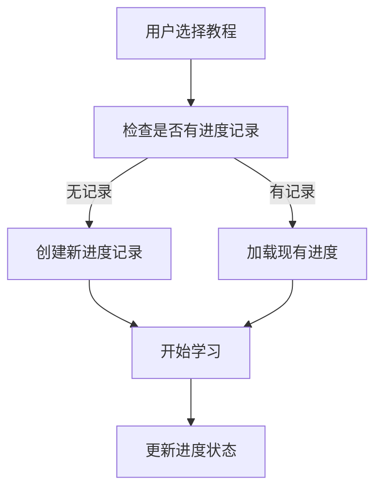
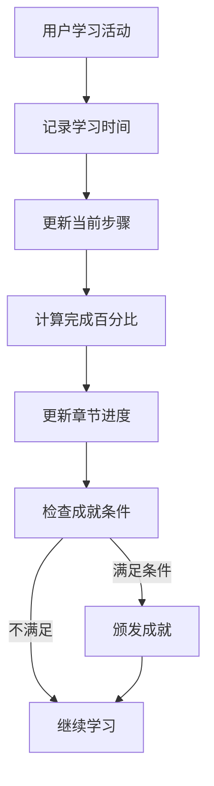
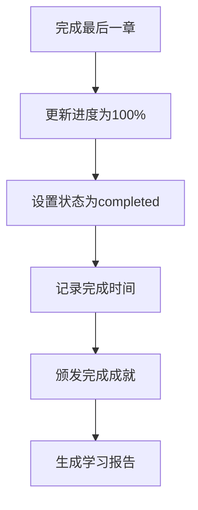

# 任务进度管理功能说明

## 概述

任务进度管理是GitHub仓库学习平台的核心功能之一，用于跟踪和管理用户的学习进度。该功能替代了原有的等级管理系统，提供更加灵活和详细的进度跟踪能力。

## 功能特性

### 1. 核心功能
- **进度跟踪**: 实时记录用户学习进度
- **状态管理**: 支持多种学习状态（未开始、进行中、已完成、暂停）
- **时间统计**: 记录学习时长和访问时间
- **成绩管理**: 跟踪分数和章节完成度
- **灵活扩展**: 支持自定义数据存储

### 2. 数据结构
- **用户进度**: 主要进度信息
- **章节进度**: 详细的章节学习状态
- **成就系统**: 学习成就和奖励
- **扩展数据**: JSON格式的灵活数据存储

## 数据模型

### UserProgress（用户进度）
```python
{
  "id": 1,
  "user_id": "user123",
  "tutorial_id": 1,
  "status": "in_progress",           # 学习状态
  "progress_percentage": 45.5,       # 完成百分比
  "current_step": "第2章：基础语法",   # 当前步骤
  "total_time_spent": 90,            # 总学习时间（分钟）
  "score": 85.0,                     # 总分数
  "extra_data": {                    # 扩展数据
    "chapters": {                    # 章节进度
      "1": {
        "status": "completed",
        "score": 90.0,
        "time_spent": 45,
        "attempts": 1,
        "completed_at": "2025-01-01T11:00:00Z"
      }
    },
    "achievements": ["first_chapter_completed"],
    "notes": "学习进展顺利"
  }
}
```

### Tutorial（教程）
```python
{
  "id": 1,
  "title": "Python基础入门",
  "description": "从零开始学习Python编程语言",
  "difficulty": "beginner",
  "estimated_time": 120,
  "extra_data": {
    "tags": ["python", "programming", "beginner"],
    "chapters": [
      {
        "id": 1,
        "title": "Python环境搭建",
        "description": "学习如何安装和配置Python开发环境",
        "estimated_time": 30,
        "order_index": 1
      }
    ]
  }
}
```

## API接口

### 1. 获取用户进度
```http
POST /api/progress/get
```

**用途**: 获取用户的学习进度信息

**请求示例**:
```json
{
  "user_id": "user123",
  "tutorial_id": 1  // 可选
}
```

**响应示例**:
```json
{
  "success": true,
  "user_id": "user123",
  "total": 2,
  "progresses": [...]
}
```

### 2. 创建学习进度
```http
POST /api/progress/create
```

**用途**: 为用户创建新的学习进度记录

### 3. 更新学习进度
```http
POST /api/progress/update
```

**用途**: 更新用户的学习进度和状态

### 4. 删除学习进度
```http
POST /api/progress/delete
```

**用途**: 删除用户的学习进度记录

## 业务流程

### 1. 开始学习流程


### 2. 学习进度更新流程


### 3. 完成学习流程


## 状态管理

### 学习状态
| 状态 | 描述 | 触发条件 |
|------|------|----------|
| not_started | 未开始 | 创建进度记录时的初始状态 |
| in_progress | 进行中 | 用户开始学习任何章节 |
| completed | 已完成 | 完成所有必修章节 |
| paused | 暂停 | 用户主动暂停学习 |

### 章节状态
| 状态 | 描述 | 触发条件 |
|------|------|----------|
| not_started | 未开始 | 章节的初始状态 |
| in_progress | 进行中 | 用户开始学习该章节 |
| completed | 已完成 | 用户完成该章节的所有要求 |

## 成就系统

### 成就类型
- **进度成就**: 基于学习进度的成就
- **时间成就**: 基于学习时长的成就
- **分数成就**: 基于学习成绩的成就
- **连续成就**: 基于连续学习天数的成就

### 成就示例
```json
{
  "achievement_type": "completion",
  "achievement_name": "第一章完成",
  "points": 10,
  "extra_data": {
    "description": "完成了第一章的学习",
    "badge_icon": "🎉",
    "rarity": "common"
  }
}
```

## 数据分析

### 学习统计
- **学习时长**: 总学习时间和平均学习时间
- **完成率**: 章节完成率和教程完成率
- **学习效率**: 时间投入与成绩的关系
- **学习模式**: 学习时间分布和频率

### 报表功能
- **个人学习报告**: 用户的学习进度和成就
- **教程统计报告**: 教程的受欢迎程度和完成率
- **系统概览报告**: 整体学习数据统计

## 性能优化

### 1. 数据库优化
- **索引策略**: 为常用查询字段创建索引
- **分区策略**: 按用户ID或时间分区
- **缓存策略**: 缓存热点数据

### 2. API优化
- **批量操作**: 支持批量更新进度
- **增量同步**: 只传输变更的数据
- **异步处理**: 非关键操作异步执行

### 3. 前端优化
- **本地缓存**: 缓存用户进度数据
- **懒加载**: 按需加载章节数据
- **实时同步**: WebSocket实时同步进度

## 扩展功能

### 1. 学习路径推荐
基于用户进度和偏好推荐学习路径

### 2. 社交功能
- 学习小组
- 进度分享
- 互相督促

### 3. 游戏化元素
- 经验值系统
- 等级徽章
- 排行榜

### 4. 智能分析
- 学习行为分析
- 个性化建议
- 学习效果预测

## 安全考虑

### 1. 数据隐私
- 用户进度数据加密存储
- 访问权限控制
- 数据脱敏处理

### 2. 防作弊机制
- 学习时间验证
- 进度合理性检查
- 异常行为监控

## 监控和维护

### 1. 系统监控
- API响应时间监控
- 数据库性能监控
- 错误率监控

### 2. 数据维护
- 定期数据清理
- 历史数据归档
- 数据一致性检查

## 未来规划

### 短期目标
- 完善API功能
- 优化性能
- 增加测试覆盖率

### 长期目标
- 机器学习集成
- 多平台支持
- 国际化支持
